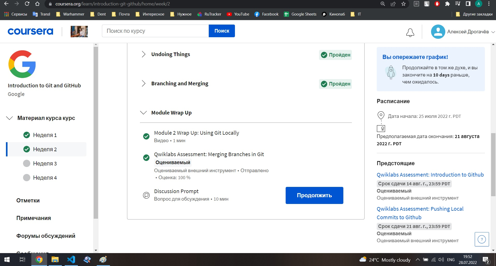
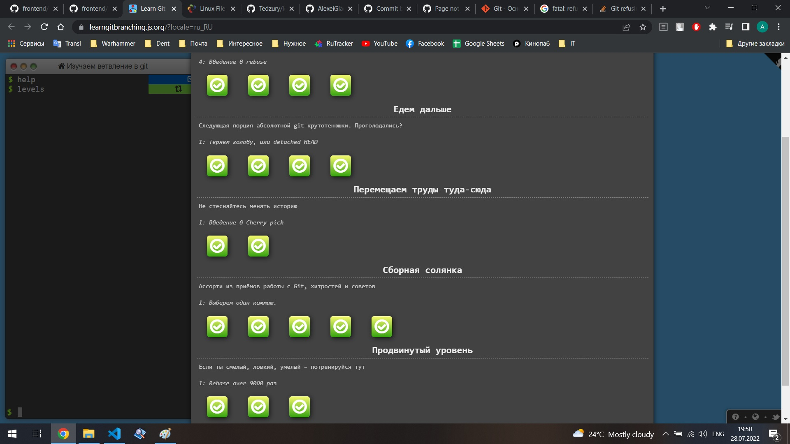
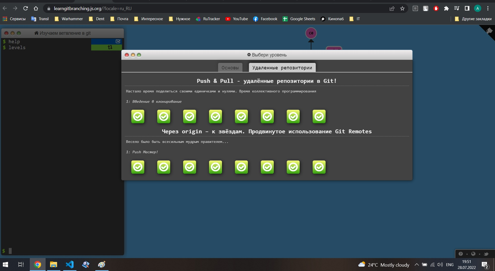

## GIT_BASICS

Цікаво було потренуватись власноруч прописувати всі команди для взаємодії з Гітом. Бо зазвичай у роботі одного студента рідко використовуєш щось окрім git init, git add, git commit та git push. Особливо робота з бранчуванням і злиттям гілок. Більше за все, напевно, здивувало налаштування і запуск віртуальної машини при виконанні завдань на Курсері, такого ще ніколи в житті не робив. В майбутньому буде використовуватись абсолютно все, що було з цієї теми, хоча наразі, під час навчання і роботи зі своїми проетами використовую лише 4 команди з усіх вивчених.

Додаю скріни виконаних завдань з першого модуля: 

## Linux CLI, and HTTP

Абсолютно новим було працювати з Лінукс через термінал. Навряд я буду переходити на Лінукс, оскільки користуюсь Віндовс. Але, хто знає, може колись виникне бажання. Тільки треба багато вільного часу, щоб прочитати документацію, встановити його і налаштувати так, щоб все добре працювало.

Спободобались дві станні статті про веб і протоколи. З різних джерел вже читав цю інформацію, але зайвим не буде повторити, сто відсотків ще кілька разів буду перечитувати цю інформацію. Ну і використовувати у повсякденній роботі буду ледь не щодня, роботи запити на сервер - це основне ще налаштовується через JS. 

Додаю скріни з виконаними завданнями:

